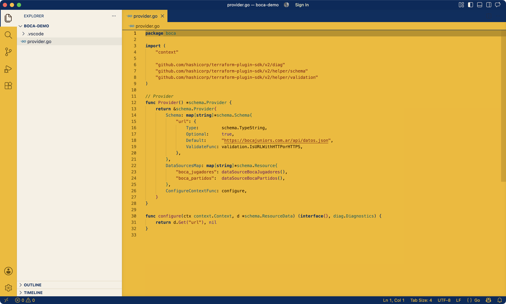

# Boca Juniors 1905 — VS Code Theme

[](https://github.com/rmpato/jugador-12/actions/workflows/ci.yml)

Azul y Oro. A light theme inspired by Boca Juniors: gold editor background, dark navy chrome (title bar, tabs, status bar), and cream side bar and panels.



## Palette

| Role | Color |
| --- | --- |
| Editor background | `#F4B802` |
| Navy chrome (title/status/tabs) | `#002B5C` / `#012F60` |
| Cream surfaces (sidebar, panel) | `#F6F0E4` |
| Ink (variables, punctuation) | `#2E1500` |
| Keywords (navy, bold) | `#002B5C` |
| Strings (brick red) | `#8A1F0F` |
| Comments (olive, italic) | `#4E6317` |
| Functions (wine) | `#7A1E5C` |
| Types and namespaces (teal) | `#00615A` |
| Properties (dark cyan) | `#0F5A7A` |
| Constants and numbers (purple) | `#5B2A86` |
| Current line highlight | `#BD9008` |

## Try it locally

1. Open this folder in VS Code.
2. Press `F5` to launch an Extension Development Host.
3. In the new window: `Cmd+K Cmd+T` → select **Boca Juniors 1905**.

## Install without publishing

```bash
npm install -g @vscode/vsce
vsce package
code --install-extension boca-juniors-1905-theme-0.1.0.vsix
```

## License

MIT
